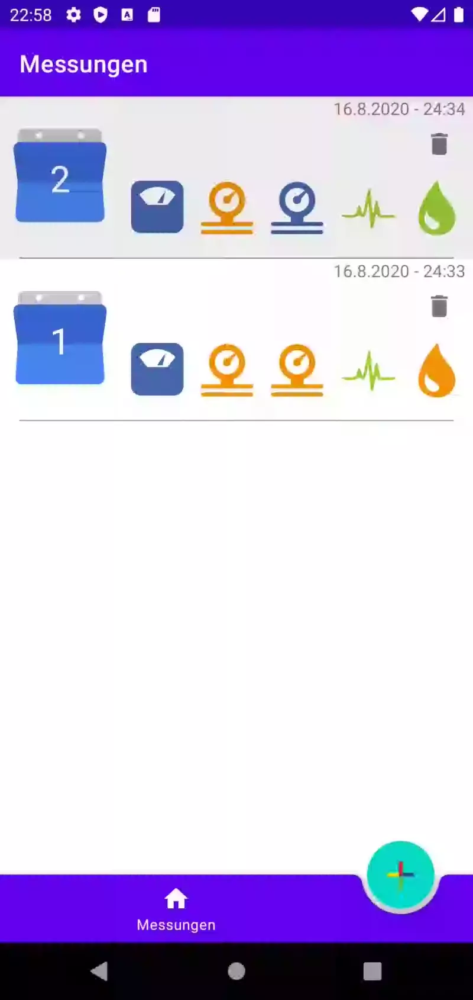

# App

  

# Intro
Android Anwendung für das Monitoring von Gesundheitsdaten.
Geschrieben mit den von Google empfohlenen Best Practices
und Bibliotheken..

  

# Sprachen
Das Projekt wurde mithilfe folgender Sprachen realisiert:
 
 * Kotlin
 * XML
 
 # Designpattern
 * MVVN

# Bibliotheken
 
 * Navigation component
 * Material Design
 * Lifecycle component
 * Navigation component
 * Room